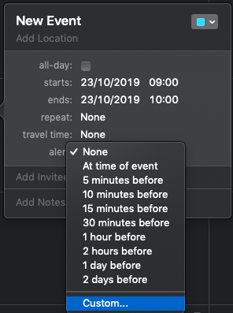
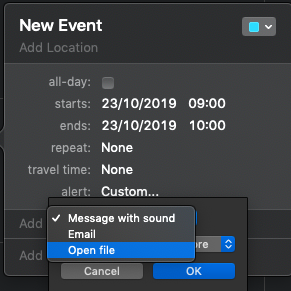
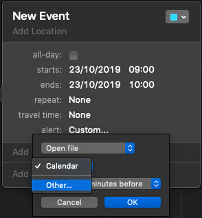
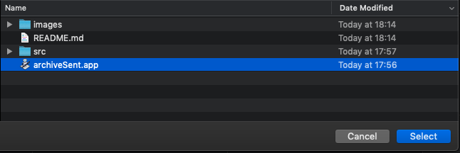
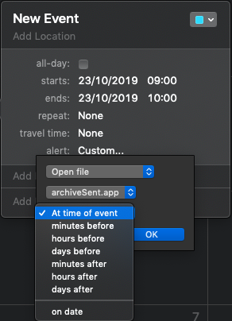

# macos-archive-sent

## Notes

- Assumes one exchange account under outlook (script picks the first account)
- Archives emails under "Sent" folder older than 21 days to "Sent" folder under "On My Computer"
- Uses native Calendar application as schedular (No additional schedular or cron needed)

## Instructions

1. Download repo
2. Look at source if curious (open src/archive.scpt)
3. Open MacOS calendar app and create an event schedule it as often as you wish (weekly, daily etc)
4. Under alert choose "custom"  
   
5. Select "Open file"  
   
6. Select "Other..."  
   
7. Select "archiveSent.app"  
   
8. Select "At time of event"  
   
9. Almost done... manually open the "archiveSent.app" just to allow the OS the open the app for the first time...
